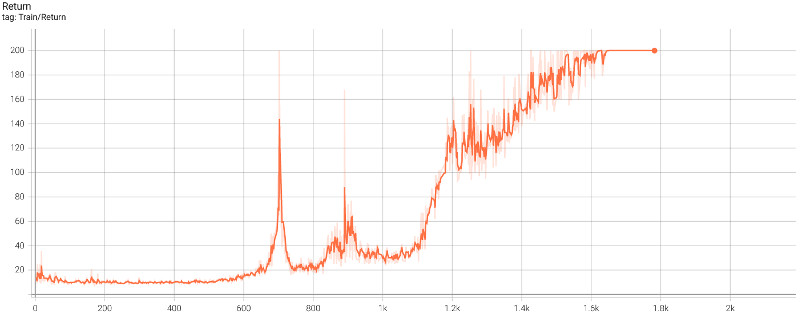
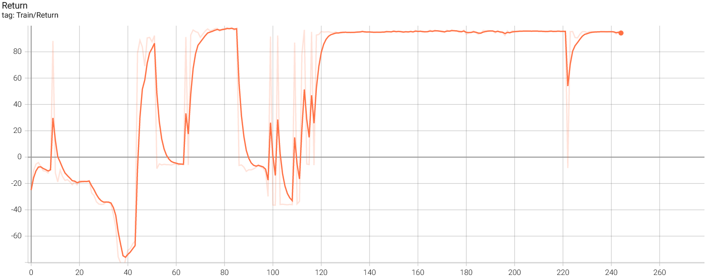

This is a PyTorch implementation of Dueling DQN with action branching architectures for [Gym](https://gym.openai.com/) environment with `Discrete` and `Box` action space.

# Action Branching Architectures

paper: https://arxiv.org/abs/1711.08946

The branching architecture is summarized as following.

For action of `Box` class, certain number of sub-actions need to be sampled from each continuous action dimension by setting parameter `act_sub_dim`, which could either be an integer or a list/tuple in the size of action dimension indication number of sub-actions for each action dimension. Given `act_sub_dim`, actions including lowest and highest possible value are equally sample from each action dimension as following.

# Train

## Requirements

python=3.8.11

torch=1.9.0

gym=0.19.0

tensorboard=2.8.0

## Start Training

Simply run `python dqn.py`.

## Results

CartPole-v1 (discrete action) and MountainCarContinuous-v0 (continuous action) of Gym environment are tested, episode return are show in the following respectively. After around 1.6k and 120 episodes for each case, the agent start to gain steady rewards.

